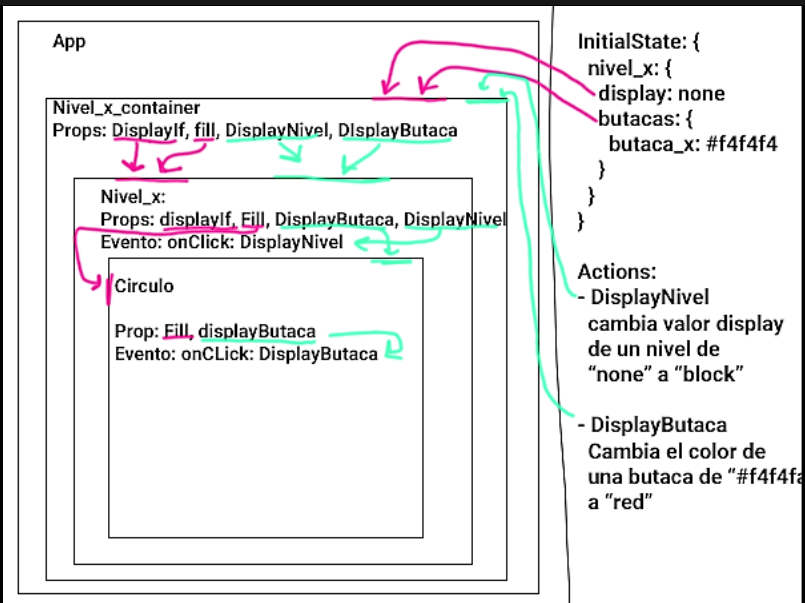

# COMPRA DE TICKETS TIPO TEATRO

Es una aplicacion que te permitirá obtener los tickets de manera eficaz.Ademas de ello puedes elegir la butaca que desees. 

.

## Desarrollado para [Laboratoria](http://laboratoria.la)

## Objetivo:

+ Desarrollar una interface que permita realizar la compra de tickets para eventos de tipo teatro,
considerar que los escenarios pueden tener más de 1 piso.

## Planificación:

+ Nos organizamos primero utilizando la referencia del LMS para entender la funcionalidad de REACT-REDUX, acontinuacion mostramos una imagen donde explicamos como se da el flujo del proyecto.




## Pasos que seguimos para realizar el proyecto

1. Primero se crean los componentes stateless (Aquellos que seran componentes bajos):Header,aside,circulo,containerCirculo,escenario y nivel-uno. A continuación un ejemplo con el componente Header
   
```
  const Header = () => (
  <div className="header">
    <header>
      
      <div className="input-group mb-3 container-input">
        <input type="text" className="form-control" placeholder="Buscar evento" aria-describedby="basic-addon2" />
        <div className="input-group-append">
          <button className="btn btn-outline-secondary white" type="button">Buscar</button>
        </div>
      </div>
      <div className="btn-group btn-group-toggle container-toggle" data-toggle="buttons">
        <label className="btn btn-secondary btn-but">
          <input type="radio" name="options" id="option1" /> Inicia Sesión
        </label>
        <label className="btn btn-secondary">
          <input type="radio" name="options" id="option2"/> Regístrate
        </label>
      </div>
    </header>
  </div>
)
     
```


2. Decicidimos que componentes seran statefull y los parametros del state que van a necesitar y las acciones que van a ralizar(Aquellos que seran componentes altos):nivelUno-container,circulo y containerCirculo

```
const mapStateToProps = state => ({
  niveles: state.reducer.niveles,
  selected: state.reducer.selected
});

const mapDispatchToProps = (dispatch) => ({
  displayButacas: bindActionCreators(displayButacas, dispatch),
  toggleButaca: bindActionCreators(toggleButaca, dispatch),
});

```

3.Definimos los states que va a necesitar la aplicación,se divide por niveles con el id, el display (none o block)y las butacas que tendran cada uno.

```
const initialState = {
    niveles:{
        1: {
            
          display:'none', 
          butacas: 10,  
        },
        2: {
           display:'none',
           butacas: 15, 
        },
        3: {
           display:'none',
           butacas: 20, 
        }
    },
    selected:{}
    }

```

4.Definimos las acciones que se van a ejecutar, se encargan de recibir y exporta parametros.

```
export const displayButacas = payload => ({ type: 'DISPLAY_BUTACAS', payload });
export const toggleButaca = payload => ({ type: 'TOGGLE_BUTACA', payload });

```

5. Construimos los reducer,donde reciben nuestros estados iniciales y acciones, en el primer caso DISPLAY_BUTACAS donde cambian el estado de los niveles, en el segundo caso TOGGLE_BUTACA es para cambiar los estados de las butacas si estan seleccionadas o no.

```
const reducer = (state = initialState, action) => {
    switch(action.type) {
        case 'DISPLAY_BUTACAS':
            return {
            ...state,
                niveles: {
                  ...state.niveles,
                  [action.payload]: {
                    ...state.niveles[action.payload],
                    display: 'block',
                  },
                }
              };
        
        case 'TOGGLE_BUTACA':
            if (state.selected[action.payload.nivel] && state.selected[action.payload.nivel][action.payload.butaca] === 'selected') {
                  return {
                    ...state,
                    selected: {
                      ...state.selected,
                      [action.payload.nivel]: {
                        ...state.selected[action.payload.nivel],
                        [action.payload.butaca]: 'noselected'
                      }
                    },
                };
            }
        
            return {
                ...state,
                selected: {
                    ...state.selected,
                    [action.payload.nivel]: {
                      ...state.selected[action.payload.nivel],
                      [action.payload.butaca]: 'selected'
                    }
                  },
                };
            default:
              return state;
          }
        }
```

## CREANDO ESCENARIO Y BUTACAS CON SVG

 * Creando niveles: Para ellos se necesitamos las coordenadas X, Y, width y heigth. Utlizamos la etiquetas rect

```
<rect x="250" y="10" width="200" height="150" fill="gray"/>
```

* Creando butacas : Las btacas seran representasa por circulos  y utilizaremos la etiqueta circle, fill es como el background del elemento, r es igual al radio , cx y cy son las coordenadas
 
```
<circle r="12" cx=200 cy=100 fill="red"/>
```

Componentes estaticos


## Algoritmo para la creación  de las butacas de forma dinamica

```
// <g> agrupa los elementos sgv como un div
  <g display={props.display}>
    {/* convierte un numero en un array , para utilizar el map, butaca es igual a index */}
    {[...Array(props.elements)].map((element, butaca) => {

     //coordenadas del eje x , y de cada circulo
     const cy = (parseInt(butaca / props.colsPerRow, 10) + 1) * 50
     const cx = ((butaca % props.colsPerRow) + 1) * 50

      return (
        <Circulo
        // le pasa las coordenadas al componente Circulo
          cx={cx}
          cy={cy}
          selected={props.selected} //select sirve para seleccionar las butacas bien seran red o gray
          nivel={props.nivel} //para indicar en que nivel esta
          butaca={butaca} //para indicar el numero de butaca
          key={`${props.nivel}_${butaca}`} //key es el numero + el numero de butaca ejem:1_2
          onClick={props.onClick}
        />
      )}
    )}
  </g>
```
## Algoritmo para la creación  de los nivel(componente unico) de forma dinamica
```
  //ancho y color del rectangulo
    const width = [0,300,500, 566]
    const fill = [0,'#0F3057','#00587A','#008891']
   
    return(
    //coordenadas del rectangulo
     <svg
       x = {(200/props.id)}
       y = {150 * props.id}
     >
     <rect
      width = {width[props.id]}
      height="150"
      fill={fill[props.id]}
      onClick={() => props.displayButacas(props.id)}
      />

```

## Herramientas:

+ React.
+ Redux.
+ Bootstrap 4.
+ JS.
+ HTML5.
+ CSS3.


## Créditos:

+ Nefeli Joñoruco.
+ Elena Japa.

## Referencias:

[Grupo de desarrolladores](https://www.facebook.com/groups/freelance.lima/about/)
